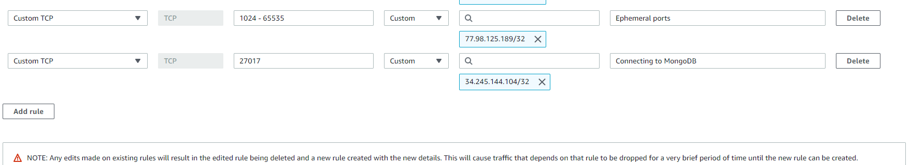
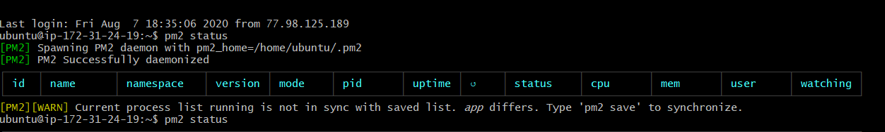
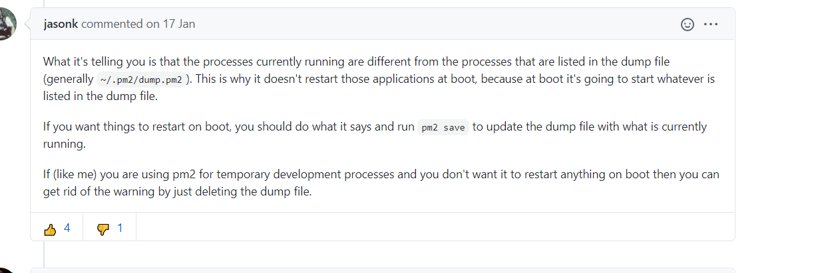

# Notes


## What is Node js

- A runtime environment which contains everything necessary to execute a program written in JavaScript,
this means js is not just excluded to run in browser but also on a machine as a stand alone application

- This means developers can run scripts server side to produce dynamic web page content before
the page is sent to the user's web browser

- The engine that node.js runs on converts JS code into faster machine code


## What is AWS
- AWS is a cloud service platform, offering compute power, database storage and other functionalities to help businesses
scale and grow

AWS allows for:
- Running application servers in the cloud to host dynamic websites
- Serve global customers with low latency due to databases being placed closer to consumers
- Storing info in multiple DBs such as MongoDB, MySQL etc


## Compute Services

AWS offers a vast array of compute services allowing clients to develop, deploy and run applications all through the cloud,
as well as the ability to scale computing up or down based on the demand


#### Lightsail
- Automatically deploys and manages compute, storage and networking capabilities to run applications

#### Elastic Compute Cloud
- Virtual Machines in the cloud which you have 

#### Lambda
- Serverless technology that allows you to run 

#### Elastic Beanstalk
- Allows automated deployment and provisioning of resources like a highly scalable production website.


### Storage Services
- S3 (Simple Storage Service) — Storage service of AWS in which we can store objects like files, folders, images,
documents, songs, etc. It cannot be used to install software, games or Operating System.


## Entering our Instance 

1) We first download a file that contains the key which will let us enter our EC2 instance
2) This key will most likely be found in our downloads folder, from git bash we run the following command to enter it
```commandline
cd
cd Downloads
```

3) Once here we will then move the file we downloaded and place it into our .ssh folder by doing the following command
```commandline
mv DevOpsStudents\ \(2\).pem ~/.ssh
```

4) We can now enter our .ssh folder by running the absolute path command
```commandline
cd ~/.ssh
```

5) Now we can run the ssh command which will allow us to enter our EC2 virtual machine
```commandline
ssh -i ~/.ssh/DevOpsStudents\ \(2\).pem ubuntu@ip-of-vm
```
At the end we have added the name of ubuntu OS and our IP address to enter our VM


### Creating A provision.sh file to automate the process

- We want to create provision.sh file into our VM so that every time we enter our VM, it can set up the exact same environment
and download all the dependencies we would need to run our app


```commandline
#!/bin/bash

# update

sudo apt-get update -y

sudo apt-get upgrade -y


# Installing nginx
sudo apt-get install nginx -y

curl -sL https://deb.nodesource.com/setup_12.x | sudo -E bash -

# Installing Node and npm
sudo apt-get install node js
sudo apt-get install npm -y

# We need to go into our app folder before we run sudo npm install, this is because this is where our package.json file is found
# this allows npm to install the dependencies
cd /home/ubuntu/app

#Looks for the package.json file and uses that to install all the dependencies necessary
# the node equivalent of pip install requirements.txt
sudo npm install

sudo npm install pm2 -g

#pm2 alllows you to manage your application

pm2 start app.js
```
Stands for Secure Copy, this command transfers files

### Creating A setup.sh file to run 


```commandline
ssh -i ~/.ssh/DevOpsStudents\ \(2\).pem ubuntu@52.214.19.30
```
This will allow us to enter our VM, similar to vagrant ssh


### Running the Node js application with a Reverse Proxy            


### Creating a Second EC2 instance to connect to Mongo DB database

### Connecting EC2 instance to mongoDB server

port 22 is our SSH port, when we run SSH vagrantr, it is communicating to that machine on port 22
port 80 is the standard for web servers
port 27017 is where mongoDB communicates

In order for our app to get data from our DB, we need to add app to the inbound rules of the db, so the db allows access
to the db




sudo npm install


### Errors

When I tried to rerun the application the next day (thus the VM had a different IP) I received this error


...

This error is most likely due to my dump file, which was explained below



We will have to run pm2 save --force
and get the response ``` Successfully saved in /home/ubuntu/.pm2/dump.pm2 ```


Got an error where I tried to run my provision.sh file in my VM:

```commandline
Bash script and /bin/bash^M: bad interpreter: No such file or directory [duplicate]

```
It was overcome by running this command
```
sed -i -e 's/\r$//' scriptname.sh
```

Got an error when trying to manually install mongoDB

```commandline
E: Unable to acquire the dpkg frontend lock (/var/lib/dpkg/lock-frontend), is another process using it?
```

used the below code to correct it
```commandline
sudo dpkg --configure -a
```


mongod.conf file not syncing when my db/provision.sh file runs, therefore I manually go into the file by
```commandline
cd # cd to the root 
cd /etc
nano mongod.conf # in here we add what should be added to my mongod.conf file
```

Now I must restart mongod for these changes to take place
Restart will look at the mongod.conf file and will run based on the what is inside that file
```commandline
systemctl restart mongod
```

Now we will recheck the mongod status to see if it is running
```commandline
systemctl status mongod
```

Note that sometimes when I run my provision.sh file, some commands don't erun, e.g. my env variables aren't set
```commandline

```