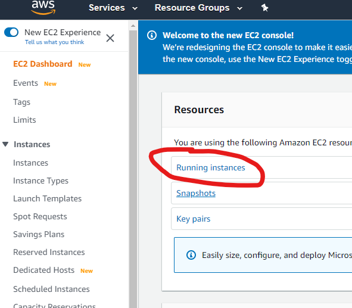

# Running A Node JS Application On An EC2 Instance

#### Click [HERE](https://github.com/aosborne17/Nodejs-App-EC2-Instance/blob/master/DETAILED-NOTES.md) for more detail on AWS 

## Prerequisites
- Git Bash [Here](https://git-scm.com/downloads)

As you can see here the prerequisites for this project are small here, this details the beauty of AWS and Cloud Computing.
It minimises any need for local installations

## Creating an EC2 instance
- Providing you have created an AWS account, go to the dashboard and click running instances
- From here you will have the ability to choose what machine you would like as well as the configurations
 

## Entering Our Cloud Machine

- Once you have received the IP address, we can enter the VM using the following command
