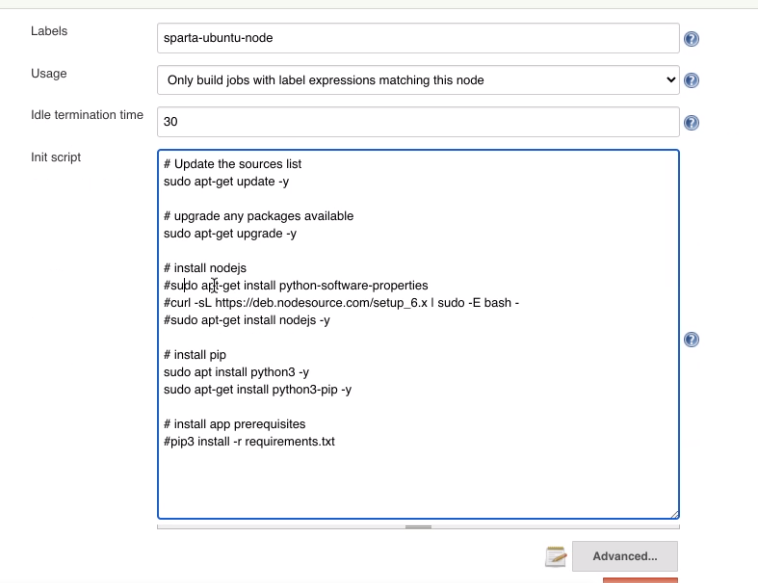
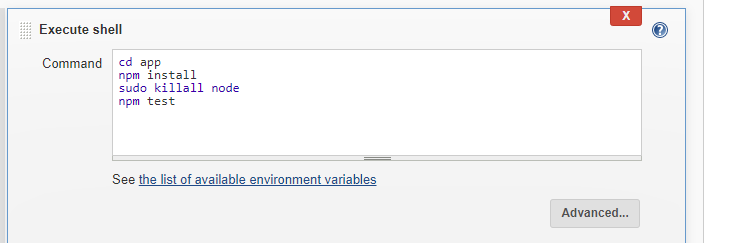

When we click on **workspaces** it shows us the code that is within our build


'Sparta-ubuntu-node' is simply a instance that has been created on AWS for us, within it, it contains the following 
code




CI and CD should have two seperate jobs, if the CI is working then we create a new job after for the CD

WE can trigger the second build based on the first
"trigger this build if 'name-of-previous-build' is successful"

The second job should move the code from one server to another server and then send an email to inform us
The second job should then push these changes onto the live web server
If we make a change to the sparta global image and input a new one then it should merge successfully and then be deployed
on the server

In order to do this, what would you need? 
- consider security groups

The DevOpdStudents ssh key exists in jenkins and in AWS


## Getting the integration tests to work on Jenkins

Mocha is the module running the tests, the below command makes sure after we test we exit


In addition we must commenting out the psots function in order for our tests to pass succesfully


Our build to may fail due to their being another app listed on port 3000, this can be overcome by running ``` sudo killall node ```
into the execute shell as seen below




### removing the remote

We want to remove the remote and add our own remote, thus we can point it to our own repository
```commandline
git remote rm origin
```

Now when we run ```git remote --v```, there shouldn't be any remote's

We will now make a repo from which we will have this folder point to, after we have created the repo we run the following
command
```commandline
git@github.com:aosborne17/Node-App-Pipeline.git
```

or for http we could run
```commandline
git remote set-url origin https://github.com/aosborne17/Node-App-Pipeline.git
```

We can now push to github
```commandline
git push -u orgin master
```

